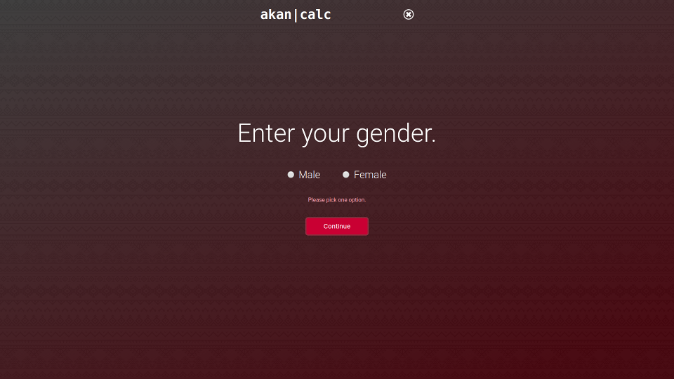

#### https://VictorKMaina.github.io/AkanCalculator/index.html
# Akan Calculator
#### Calculates a user's day of birth and assigns an Akan name based on gender
#### February 16,2020
#### By *Victor K. Maina*
## Description
Akan Calculator is exactly what its name suggests — a calculator. The project is a website that takes a user's birthday as input and calculates which day of the week they were born. The website then assigns the user an Akan name based on their gender, and displays this information on the user's screen. The site has three pages — the home page, the steps page, and the list of Akan names.

### Homepage


The homepage acts like a landing page, displaying a short introduction to Akan naming. On it, there is a link to an Akan names list and a button to the calculator. The list is a simple page that contains all the male and female Akan names according to the days of the week.

### Steps page


The steps page carries the user through three steps. The first step takes in the user's birthday. If an invalid date is entered, it brings up an error message on the page asking the user to enter a valid date. This step also accounts for leap years. By definition, a leap year is divisible by 4. It is not a leap year if it is divisible by 100, unless it is also divisible by 400. Using this knowledge, the web app can make sure that a proper date is entered, and will alert the user if a date above 28th of February is entered on a non-leap year. Simply put, the page will bring up an error if the date entered exceeds the number of days in a given month.


After submitting their date of birth, the user clicks on a button that takes them to the next step. Here, the user selects a gender, either male or female. If no option is selected, the user recieves an error message.



On the next step, the user gets to see their Akan, as well as the day on which they were born. There is a reset button that clears all the forms and returns the user to the first step.


All the steps are on one HTML file. Whenever the user clicks the "Continue" button, the current `<div>` is hidden and the next one is revealed. This is done by simply toggling the `display` property in CSS through JavaScript. By keeping all the steps on one HTML file, none of the data stored in the JavaScript variables is lost.

## Setup/Installation Requirements
To use the web app, go to [this link](https://victorkmaina.github.io/AkanCalculator/index.html "Akan Calculator"). All you will need is a web browser. The website is screen-responsive, so you can use it easily on a mobile device or tablet.

If you would like to edit the page or customize it, you will need to install a code editor, preferably [Visual Studio Code](https://code.visualstudio.com "Visual Studio").

To install it on Ubuntu, open the terminal (CTRL + ALT + T) and enter:
```
$ sudo apt install code
```
To install on Windows or MacOS, download it from the website and install.

After installing Visual Studio Code, download the repo by clicking [this link](https://github.com/VictorKMaina/AkanCalculator/archive/master.zip "Download Repo"). Or, if you are on Linux, you can install git and then clone the repo:
```bash
$ sudo apt install git
$ sudo git clone https://github.com/VictorKMaina/AkanCalculator.git
```
Then open the folder in Visual Studio:
```bash
$ code .
```
or launch Visual Studio and do `File > Open Folder... > AkanCalculator`.
## Technologies Used
This website was developed using:
* Visual Studio Code
* HTML, CSS, and JavaScript
* Google Chrome Developer Tools
* Ubuntu 18.04
* Git v2.17.1
* GitHub

## Support and contact details
If you would like to contact me, email me at [vk13runic@gmail.com](mailto:vk13runic@gmail.com "E-mail me"). The project is open-source, so feel free to edit it and use it as you wish. If you have any ideas on how to make it better, don't hesitate to reach out.
## License
MIT License

Copyright (c) 2020 Victor K. Maina

Permission is hereby granted, free of charge, to any person obtaining a copy
of this software and associated documentation files (the "Software"), to deal
in the Software without restriction, including without limitation the rights
to use, copy, modify, merge, publish, distribute, sublicense, and/or sell
copies of the Software, and to permit persons to whom the Software is
furnished to do so, subject to the following conditions:

The above copyright notice and this permission notice shall be included in all
copies or substantial portions of the Software.

THE SOFTWARE IS PROVIDED "AS IS", WITHOUT WARRANTY OF ANY KIND, EXPRESS OR
IMPLIED, INCLUDING BUT NOT LIMITED TO THE WARRANTIES OF MERCHANTABILITY,
FITNESS FOR A PARTICULAR PURPOSE AND NONINFRINGEMENT. IN NO EVENT SHALL THE
AUTHORS OR COPYRIGHT HOLDERS BE LIABLE FOR ANY CLAIM, DAMAGES OR OTHER
LIABILITY, WHETHER IN AN ACTION OF CONTRACT, TORT OR OTHERWISE, ARISING FROM,
OUT OF OR IN CONNECTION WITH THE SOFTWARE OR THE USE OR OTHER DEALINGS IN THE
SOFTWARE.